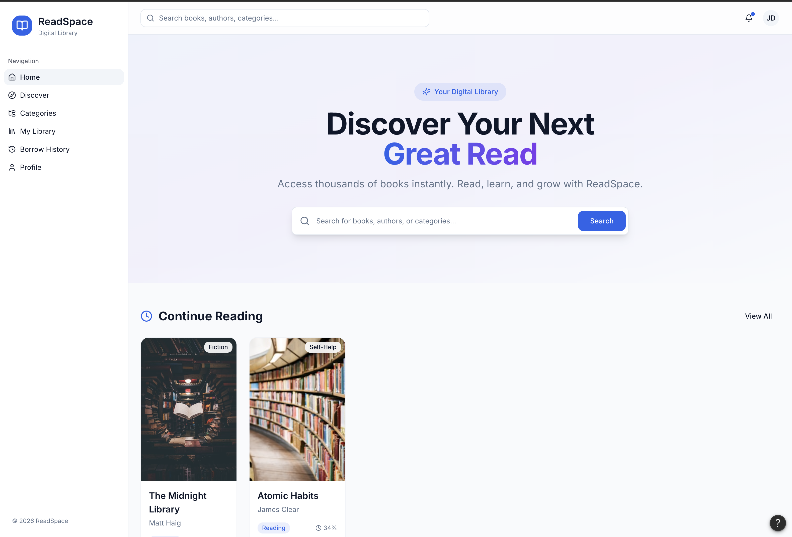
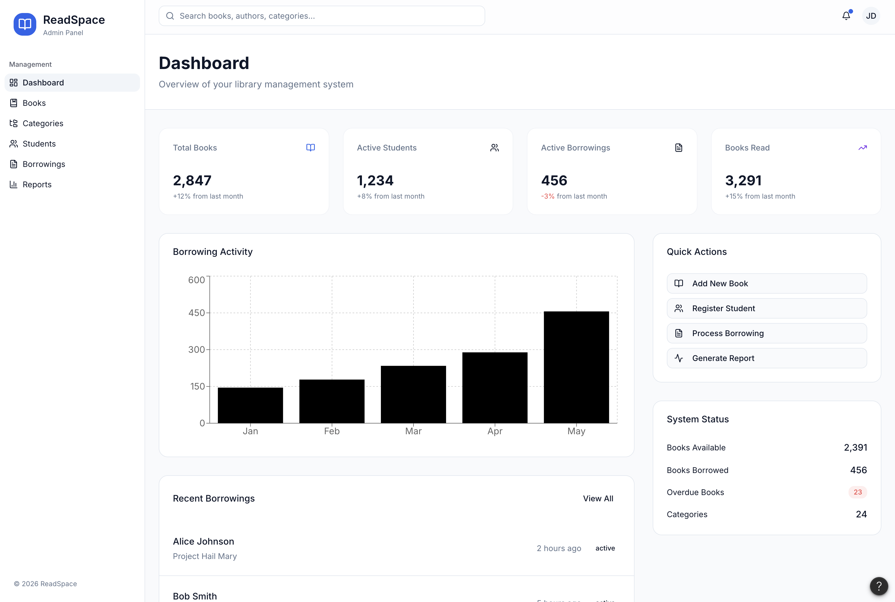

# ReadSpace

<p align="center">
  
</p>

ReadSpace adalah aplikasi SaaS perpustakaan digital berbasis Next.js. Project ini menggabungkan pengalaman menemukan buku, membaca buku digital, mengelola koleksi pribadi, serta administrasi peminjaman untuk kebutuhan perpustakaan sekolah atau institusi.

## Preview

| User Home | Admin Dashboard |
| --- | --- |
|  |  |

## Fitur Utama

- Autentikasi dengan role `student` dan `admin`
- Mode demo/mock saat Supabase belum dikonfigurasi
- Discovery, pencarian, kategori, dan detail buku dari BukuAcak API
- Pencarian dan reader berbasis OpenLibrary
- Reading history dan reading lists pribadi
- Katalog internal ReadSpace Books untuk buku perpustakaan
- Sistem peminjaman, pengembalian, status overdue, denda, dan audit log
- Dashboard admin dengan statistik, laporan, manajemen siswa, buku, kategori, dan peminjaman
- UI responsive dengan dark mode, loading state, empty state, dan error boundary
- SEO dasar melalui sitemap dan robots route

## Tech Stack

- Next.js 16.2.6
- React 19.2.4
- TypeScript
- Tailwind CSS 4
- Supabase Auth, Database, RLS, dan SSR
- TanStack React Query
- shadcn/ui, Base UI, dan komponen UI lokal
- React Hook Form, Zod, dan Hookform Resolvers
- Lucide React
- Recharts
- GSAP
- Sonner
- date-fns

## Arsitektur Data

ReadSpace memisahkan sumber data berdasarkan tanggung jawabnya.

| Domain | Sumber | Fungsi |
| --- | --- | --- |
| BukuAcak | `https://api.bukuacak.shabsolute.tech/api/v1` | Discovery, search, kategori, metadata buku |
| OpenLibrary | `https://openlibrary.org` | Pencarian buku online, detail work/edition, cover, dan reader |
| ReadSpace Books | Supabase | Inventori internal, peminjaman, profil, history, list baca, aktivitas, audit |

BukuAcak hanya menyediakan metadata seperti judul, cover, author, publisher, summary, ISBN, dan kategori. Konten baca digital berasal dari OpenLibrary, sedangkan data user dan peminjaman tetap disimpan di Supabase atau localStorage saat mode mock aktif.

## Demo Account

Mode demo bisa langsung dipakai tanpa membuat project Supabase.

| Role | Email | Password |
| --- | --- | --- |
| Student | `student@readspace.com` | bebas |
| Admin | `admin@readspace.com` | bebas |

Jika Supabase belum dikonfigurasi, login lain juga akan dibuat sebagai mock session lokal.

## Persyaratan

- Node.js minimal 20.9
- npm
- Akun Supabase, opsional untuk mode demo tetapi diperlukan untuk mode database penuh

## Menjalankan Project

Clone repository dan install dependency.

```bash
git clone <repository-url>
cd library-saas
npm install
```

Buat file `.env.local` di root project jika ingin memakai Supabase.

```env
NEXT_PUBLIC_SUPABASE_URL=your-supabase-url
NEXT_PUBLIC_SUPABASE_ANON_KEY=your-supabase-anon-key
```

Jalankan development server.

```bash
npm run dev
```

Buka `http://localhost:3000`, lalu login dengan demo account atau akun Supabase.

## Setup Supabase

Untuk memakai mode database penuh, buat project Supabase lalu jalankan SQL berikut melalui Supabase SQL Editor secara berurutan:

1. `supabase/seed.sql`
2. `supabase/readspace-books.sql`
3. `supabase/openlibrary.sql`
4. `supabase/activities.sql`
5. `supabase/update_schema.sql`

Schema utama yang digunakan:

- `profiles`
- `favorites`
- `borrowings`
- `readspace_books`
- `readspace_borrowings`
- `reading_history`
- `reading_lists`
- `activities`
- `audit_logs`

Role user dibuat dari tabel `profiles`. Email yang mengandung kata `admin` akan diberi role admin oleh trigger pada `seed.sql`.

## Script

| Command | Fungsi |
| --- | --- |
| `npm run dev` | Menjalankan server development |
| `npm run build` | Membuat production build |
| `npm run start` | Menjalankan production server |
| `npm run lint` | Menjalankan ESLint |

## Route Penting

| Route | Deskripsi |
| --- | --- |
| `/` | Home student dan discovery ringkas |
| `/login` | Login dan register |
| `/discover` | Browse dan search buku BukuAcak |
| `/categories` | Kategori buku |
| `/books/[id]` | Detail buku dari BukuAcak |
| `/openlibrary` | Pencarian buku OpenLibrary |
| `/openlibrary/[workId]` | Detail buku OpenLibrary |
| `/openlibrary/read/[workId]` | Reader OpenLibrary |
| `/library` | Koleksi pinjaman dan saved books |
| `/reading-lists` | Want to read, currently reading, finished |
| `/history` | Riwayat peminjaman dan aktivitas |
| `/profile` | Profil user |
| `/readspace-books` | Katalog internal perpustakaan |
| `/admin` | Dashboard admin |
| `/admin/books` | Manajemen buku dari sumber eksternal |
| `/admin/readspace-books` | Manajemen inventori internal |
| `/admin/borrowings` | Manajemen peminjaman dan pengembalian |
| `/admin/students` | Manajemen siswa |
| `/admin/reports` | Laporan dan statistik |
| `/admin/audit-logs` | Audit timeline |

## Struktur Project

```txt
src/
  app/                  Next.js App Router routes
  components/           Komponen UI, layout, dan card buku
  features/auth/        Form, schema, dan hook autentikasi
  lib/                  Utility dan konstanta
  providers/            Supabase, theme, dan React Query provider
  services/api/         Integrasi BukuAcak dan OpenLibrary
  services/supabase/    Client Supabase dan operasi database
supabase/               SQL schema dan seed database
docs/                   PRD, SRS, desain, arsitektur, dan dokumentasi project
public/                 Logo, asset publik, robots
```

## Dokumentasi Project

- `docs/PRD.md`
- `docs/SRS.md`
- `docs/ARCHITECTURE_SUMMARY.md`
- `docs/DATABASE-DESIGN.md`
- `docs/DESIGN-SYSTEM.md`
- `docs/BUKU-ACAK-API-INTEGRATION.md`
- `docs/DATA-SOURCES-RULE.md`

## Deployment

Project ini sudah memiliki `vercel.json` dengan framework `nextjs`, sehingga bisa dideploy ke Vercel. Tambahkan environment variable berikut di dashboard Vercel jika memakai Supabase:

```env
NEXT_PUBLIC_SUPABASE_URL=your-supabase-url
NEXT_PUBLIC_SUPABASE_ANON_KEY=your-supabase-anon-key
```

Build production:

```bash
npm run build
```

Lalu jalankan production server:

```bash
npm run start
```
